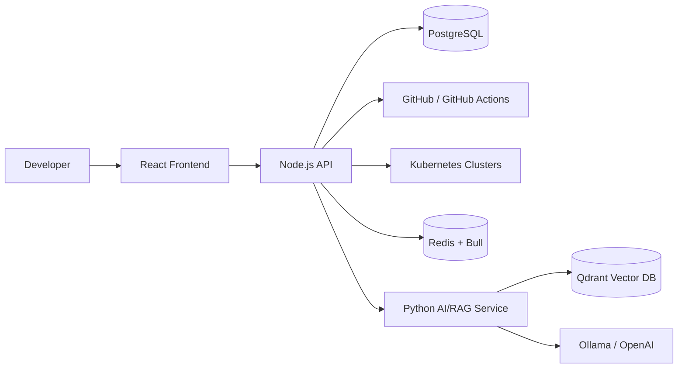

# AI DevOps Copilot — Frontend

A React + TypeScript operations console for **AI DevOps Copilot**, a cloud-native platform that brings CI/CD visibility, GitHub Actions data, Kubernetes observability, build-failure investigation, and an AI assistant into a single developer-facing interface.

This repository is the **presentation and interaction layer** of the platform. It does not contain the LLM/RAG implementation and it does not directly talk to GitHub or Kubernetes. Instead, it communicates with the Node.js backend, which acts as the platform API and integration layer.

## What this application provides

The frontend is organized around four operational workflows:

- **Platform dashboard** — high-level repository, pipeline, build, AI, and Kubernetes health information.
- **Builds and CI/CD** — pipeline statistics, recent workflow/build information, build duration trends, build success/failure views, agent usage, and failure-focused views.
- **Kubernetes operations** — cluster registration, cluster selection, namespace/resource navigation, resource details, pod usage, Kubernetes events, and cluster health information.
- **AI DevOps Assistant** — conversational access to the platform's live operational data and build-failure analysis capabilities exposed by the backend AI workflow.

The UI also contains authentication, profile/session handling, reusable cards/tables/charts, loading states, dialogs, selectors, and notification components.

## Architecture



### Request flow

The frontend uses a single API client in `src/service/Server.ts`. Requests carry the access token in the `x-access-token` header and use credentialed requests for the session/refresh flow.

When an access token expires, the API client coordinates a single refresh request through a shared `refreshPromise`. Once a new access token is returned, the original request is retried. Invalid/expired sessions trigger client logout state cleanup.

## Main application areas

### Dashboard

The home view aggregates operational signals into a developer-friendly overview. The source includes components for repository details, AI health, Kubernetes health, pipeline/build metrics, and operational cards.

### Builds

The build experience consumes backend workflow data and presents:

- total and failed pipeline counts
- build/run information
- main-branch build information
- build-duration trends
- agent usage data
- build success-rate data
- build-failure views

The charting layer uses reusable components built around Recharts.

### Kubernetes

The Kubernetes UI is intentionally resource-oriented. It supports selecting a provider/environment, cluster/namespace context, and resource types such as:

`pods`, `deployments`, `services`, `jobs`, `replicaSets`, `statefulSets`, `daemonSets`, `cronJobs`, `ingress`, `configMaps`, `secrets`, `persistentVolumes`, and `namespaces`.

Resource-specific views can drill into an individual object and expose additional details. The UI also consumes Kubernetes events and pod-usage metrics.

The backend data model currently recognizes these cluster providers:

- `LOCAL`
- `AWS_EC2_K3S`
- `AWS_EKS`
- `AZURE_AKS`
- `GCP_GKS`

and these environments:

- `DEVELOPMENT`
- `STAGING`
- `PRODUCTION`

### AI Assistant

The assistant page provides the chat experience for the Python AI service. Conversation history is loaded through the Node.js API and messages are created/updated through the chat endpoints.

The frontend intentionally keeps AI reasoning out of the UI layer. The AI service decides when to use live operational tools versus stored RAG context; the frontend is responsible for conversation UX and rendering the response.

## Frontend technology

The source code uses:

- React + TypeScript
- React Router
- Material UI (`@mui/material` / `@mui/system`)
- TanStack React Query
- Zustand
- Axios
- Recharts
- Lucide icons
- `react-hot-toast`
- `js-cookie`

## Project structure

```text
src/
├── components/              # Reusable UI building blocks
│   ├── charts/              # Build/usage charts
│   ├── kubernetes/          # Kubernetes resource UI
│   ├── kubernetesRegisteration/
│   ├── build-failures/
│   ├── buildRunsGrid/
│   ├── pipeline-runs/
│   ├── header/
│   └── ...
├── hooks/                   # React Query/data-fetching hooks
├── pages/                   # Route-level screens
│   ├── home/
│   ├── builds/
│   ├── kubernetes/
│   ├── assistant/
│   ├── logViewer/
│   └── login.tsx
├── helper/                  # Types, formatting, auth/store helpers
├── service/                 # Backend API client
├── routes/                  # Application routing/auth guards
├── theme/                   # Material UI theme
├── styles/                  # Global styling
└── utils/                   # Notifications and utility types
```

## API integration

The frontend is currently built around these backend areas:

| Area | Example frontend API calls |
|---|---|
| Authentication | `/api/users/v1/login`, `/api/users/v1/logout`, `/api/users/v1/profile`, `/api/users/v1/refresh` |
| Build data | `/api/actions/v1/pipeline`, `/api/actions/v1/info/build`, `/api/actions/v1/info/main` |
| Build analytics | `/api/actions/v1/build/chart`, `/api/actions/v1/agent/usage`, `/api/actions/v1/success/rate` |
| Dashboard | `/api/actions/v1/dashboard/rd`, `/api/actions/v1/dashboard/repos`, `/api/kubernetes/v1/dashboard/kube` |
| AI conversations | `/api/chats/v1/stream/:branch`, `/api/chats/v1/chat/:branch`, `/api/chats/v1/new/message/:branch` |
| Kubernetes registration | `/api/kubernetes/v1/register/cluster`, `/api/kubernetes/v1/clusters` |
| Kubernetes resources | `/api/kubernetes/v1/info/...`, `/api/kubernetes/v1/ns`, `/api/kubernetes/v1/resources/:type`, `/api/kubernetes/v1/resource/detail/...` |
| Kubernetes events/usage | `/api/kubernetes/v1/events/:namespace`, `/api/kubernetes/v1/pods/usage/:namespace` |
| Provider/environment | `/api/kubernetes/v1/prov/env`, `/api/kubernetes/v1/envs` |

## State and data fetching

The application uses two complementary approaches:

- **Zustand** for local application state such as authentication and Kubernetes resource selection.
- **TanStack React Query** for server state, query caching, loading states, and request lifecycle management.

This separation keeps UI selection state independent from backend-backed operational data.

## Authentication flow

```text
Login form
   ↓
Node.js /api/users/v1/login
   ↓
Access + refresh session
   ↓
Frontend stores/reads access token from cookie
   ↓
API requests use x-access-token
   ↓
401 + refreshRequired
   ↓
Call /api/users/v1/refresh
   ↓
Retry original request
   ↓
Force logout when refresh/session is invalid
```

Protected routes are guarded by the Zustand authentication state. The authenticated application shell contains the header, navigation, contextual footer controls, and nested feature pages.

## Running the frontend

The supplied source archive used for this repository review contains the application source but not the dependency manifest/build configuration files. Therefore this README deliberately avoids inventing package-manager commands or dependency versions.

Use the package manager and scripts defined in the actual repository (`package.json`) to install dependencies and start the development server.

The API client currently uses a same-origin base URL (`Server.BASE_URL = ""`). In a deployed environment, the frontend therefore expects the API to be reachable through the same origin or through the project's existing reverse-proxy/ingress configuration.

## Configuration and integration notes

The frontend expects the backend to provide:

1. authentication/session endpoints;
2. GitHub Actions/build APIs;
3. Kubernetes APIs;
4. chat/conversation APIs;
5. dashboard/analytics APIs.

A production deployment should also ensure the browser-facing API is served over HTTPS and that CORS/cookie settings match the deployment topology.

## Design goals

This frontend is intentionally an **operations console**, not a collection of isolated dashboards. The navigation and state model connect the same operational context across:

`GitHub → builds → failures → Kubernetes → AI investigation`

The result is a UI intended to help an engineer move from a high-level signal to the underlying operational context without switching between multiple tools.

## Related services

This repository is one part of the AI DevOps platform:

- **Node.js backend** — API, authentication, GitHub integration, persistence, Kubernetes integration, queues, and AI orchestration.
- **Python AI/RAG microservice** — intent-aware AI agent, tool calling, embeddings, Qdrant retrieval, and LLM provider integration.

## Status

This repository represents the frontend implementation of the AI DevOps Copilot platform. The codebase contains production-oriented patterns such as protected routes, token refresh coordination, query-based server state management, reusable operational components, resource-specific Kubernetes views, and a dedicated API abstraction layer.
